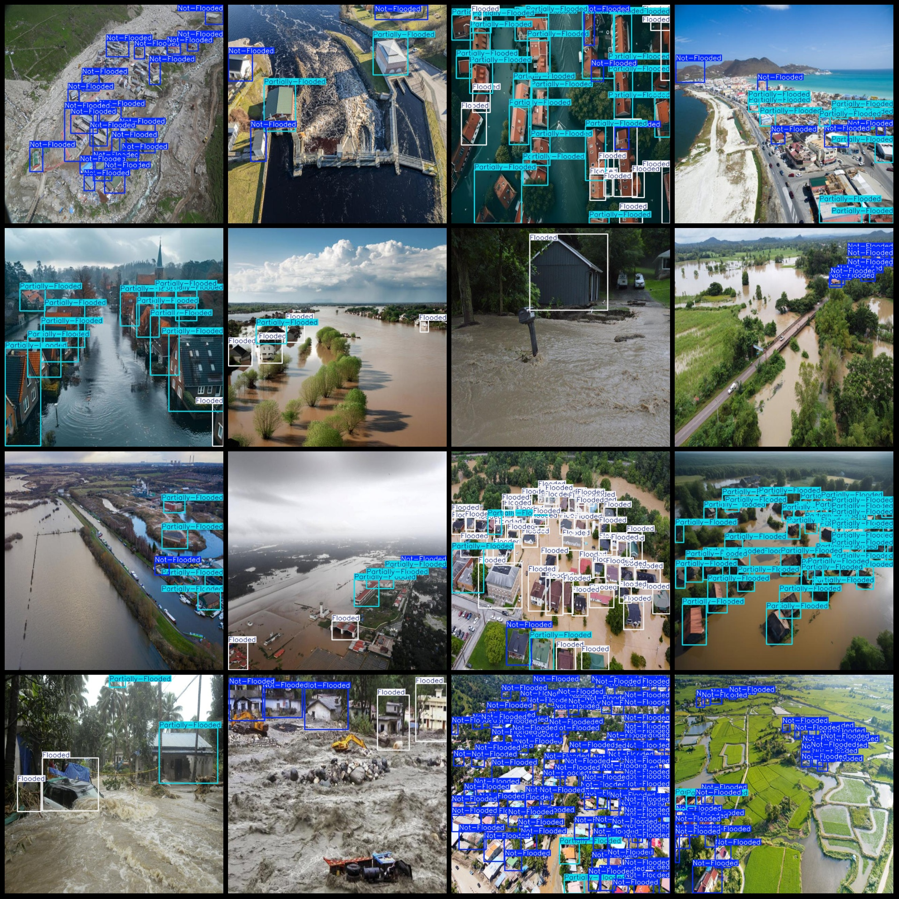
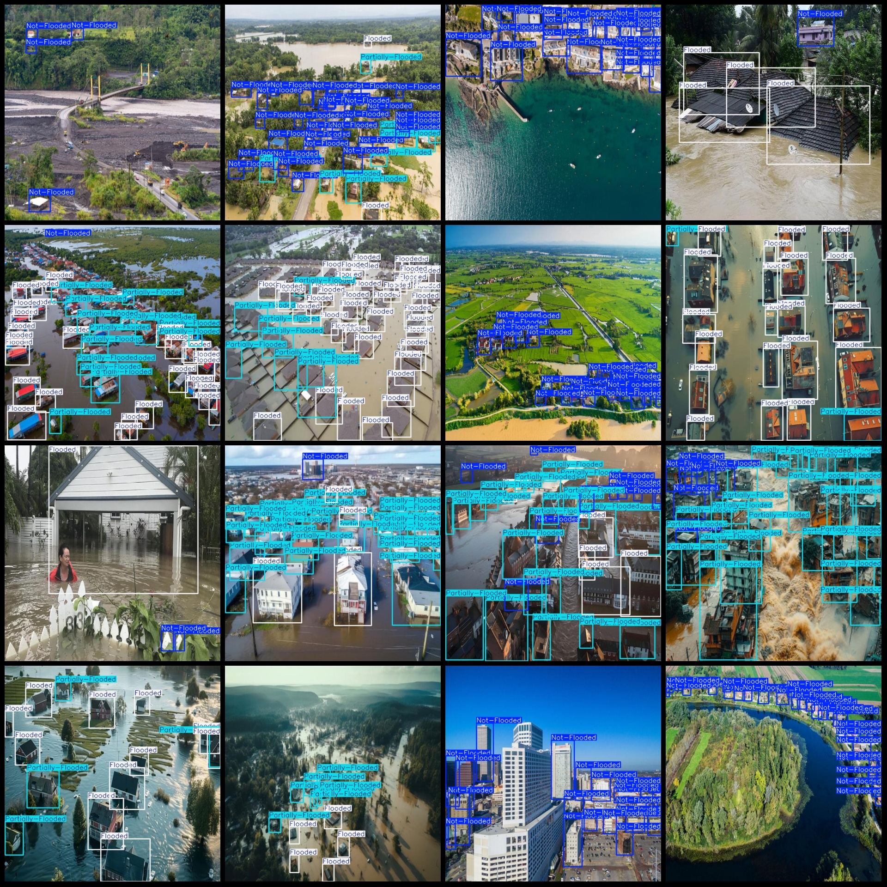

# Drone Viewpoint Floodwater and House Submergence Detection Dataset (VOC+YOLO)

## Dataset Format
Pascal VOC format + YOLO format (txt file without segmentation path, only contains jpg images and corresponding VOC format xml files and YOLO format txt files)

Number of Image Files (jpg files): 1149
Number of Annotation Files (xml files): 1149
Number of Annotation Files (txt files): 1149
Number of Annotation Categories: 3
Annotation Category Names (not in the order mentioned in this document, but refer to the labels folder 'classes.txt'): ["Flooded", "Not-Flooded", "Partially-Flooded"]

Number of Boxes for Each Category:
Flooded (Completely submerged) boxes = 5632
Not-Flooded (Not submerged) boxes = 10170
Partially-Flooded (Partial submerged) boxes = 10222

Application Area: Typically used for evaluating the impact of flood disasters, describing the waterlogging situation of buildings or areas.
Total Boxes: 26024
Image Resolution: 640x640
Compression Size: 77.7M
Drone: DJI Mavic Pro
Collection Height: 50-100m
Collection Angle: 60-90°
Annotation Tool: labelImg
Annotation Rules: Draw rectangular boxes for categories
Important Notice: No specific information provided at this time
Special Declaration: This dataset does not guarantee the accuracy of the trained models or weight files

**Annotation Example:**

## Images

Here is a pay link on Stripe ( https://buy.stripe.com/3cs8yP7sY87d0vu9AB ). Please contact me lonlonago@foxmail.com after funding $89, and I will send you a complete data files , thank you!

